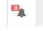
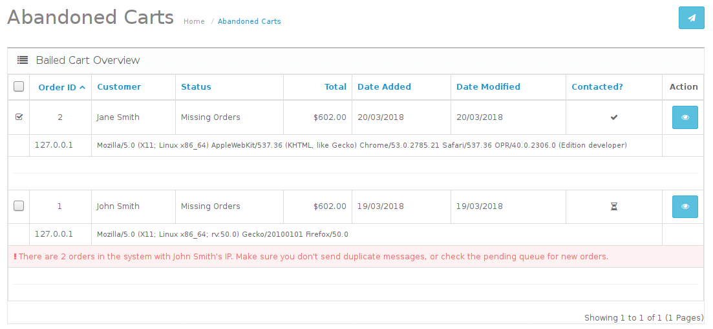

# Abandoned Carts Recovery for Open Cart v 1.0.2
For Open Cart 2.3.0.2

Languages available:
* English
* Arabic
* Brazilian Portuguese

Features
* Self-extracting in OCMOD format
* Quick configuration (2 options!)
* Unique emails customized to the prospect; complete with their first name and cart contents
* No technical skill required for use; tick a checkbox, click send and you're done.

***

**To Install**

* Download the .zip file and in admin (left navigation menu) -> Extensions Installer
* Click Upload & select the .zip
* Clear Modifications cache (orange button, then blue button on the right):

* Enable Abandoned Carts Extension by going to Extensions (left navigation menu; then clicking the green button to the right of Abandoned Carts)

* Once installed, the blue edit button will be clickable.  Click that to enter the configuration page.

Once on the configuration page, you can set how many days to go back and search for bailed carts.  Don't forget to select "Enable" to activate the plugin!

**Upgrading**
* Download the .zip (ensure you have the latest version number; unless you wish to downgrade) and upload it similarly to how you did while initially installing
* You will be prompted with a list of files that will be "replaced" (all will be files native to this extension; click Continue to proceed)
* Head to Modifications on the navigation menu -> clear cache (orange button, then blue button on the right)
You should now be upgraded to the latest version.

***

## Usage ##

On the next page load, you should see an alert indicating issues that may need your attention.  For each abandoned cart, the alert count will +1

By clicking the alerts icon, you will see a new Bailed Carts entry.  Following that link, will take you to a list of all unpaid shopping carts that meet your criteria set in the Abandoned Carts configuration.

As you can see from this screenshot, the system automatically will notify you if this user has another order in the system -- one might indicate a successful checkout.  In such event, you want to ensure you don't send them an email from this screen without verifying they haven't already completed checkout (or already received a follow-up)!

To trigger an email, put a checkmark beside any user you would like to get in touch with.  Once you selected user(s), click the paper airplane icon on the upper right-hand side of the page and a follow-up email will be sent from you:
> Hi, Jane
>
> We noticed you stopped by our shop recently and didn't complete your purchase; we just wanted to make sure this wasn't in error -- if you meant to complete checkout, you didn't complete the payment process and thus your order wasn't placed.
>
> For your convenience, here's a list of what was in your cart:
1x MacBook
>
>
> If your bailed cart was intentional, we'd love to hear any feedback, suggestions or complaints you can offer so we can improve our store and customer experience!
>
>
>
> You received this message because you (or someone using your email address) recently stopped by our shop - you have not been added to any newsletter and will not receive further communication from us as a result of your order attempt (unless you explicitly signed up to our newsletter and/or product notifications). We do not forcefully sign people up to our communications.
> We thank you for your interest in our merch; have an excellent day!
>
> Regards,
>
> Your Store
>
> `https://yoursiteurl/`

You can customize the verbiage by directly editing the language file: [abandoned_carts.php](./upload/admin/language/en-gb/extension/module/abandoned_carts.php)

### Things to consider ###
If you changed your admin url to something other  than /admin (as *everyone* should!) be sure to unzip the extension *before* you install and modify any of the filepaths for admin/ to yourhiddenadminurl/ and re-package it (do not place it in a folder to re-zip!)

This extension should be multi-store compatible out of the box, but was *not* tested to ensure compatibility.

Tested in a single shopping cart environment running PHP 7.0+

### Note ###
You do not need to clone this repository to utilize the plugin, all you have to do is download the
[zip file](releases).

You can also download it from the [Open Cart Marketplace](https://www.opencart.com/index.php?route=marketplace/extension/info&extension_id=33561).

I included the source in this repository for those who like to review the codebase prior to using new code.

### Language Info ###
The language the email is sent to the recipient in, is dependent upon the language of their 'profile' as they visited the site (which is typically the default language of the front-end of your store.)

If you would like to contribute a new language pack, please submit as a [pull request](pulls).

Arabic language translated by [Ahmed Muhayshi](https://github.com/muhayshi)

Brazilian Portuguese translated by [KEVAO28](https://github.com/KEVAO28)
