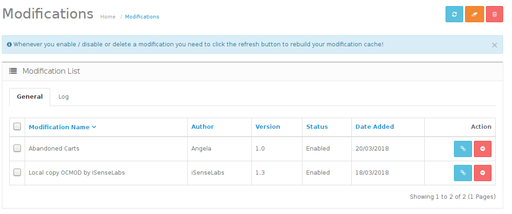
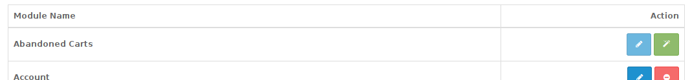
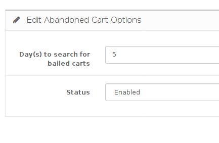

# Install Instructions
If you already have the extension installed & will be upgrading to a new release, follow the [upgrade instructions](upgrade-instructions.md), instead.

* Download the .zip file and in admin (left navigation menu) -> Extensions Installer
* Click Upload & select the .zip
* Clear Modifications cache (orange button, then blue button on the right):

* Enable Abandoned Carts Extension by going to Extensions (left navigation menu; then clicking the green button to the right of Abandoned Carts)

* Once installed, the blue edit button will be clickable.  Click that to enter the configuration page.

Once on the configuration page, you can set how many days to go back and search for bailed carts.  Don't forget to select "Enable" to activate the plugin!
